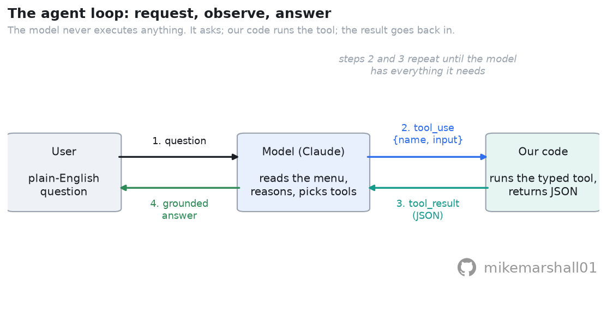
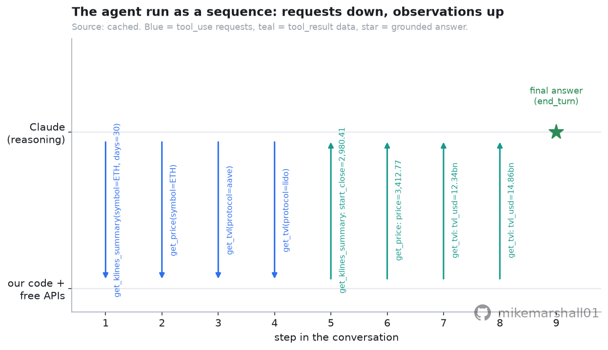
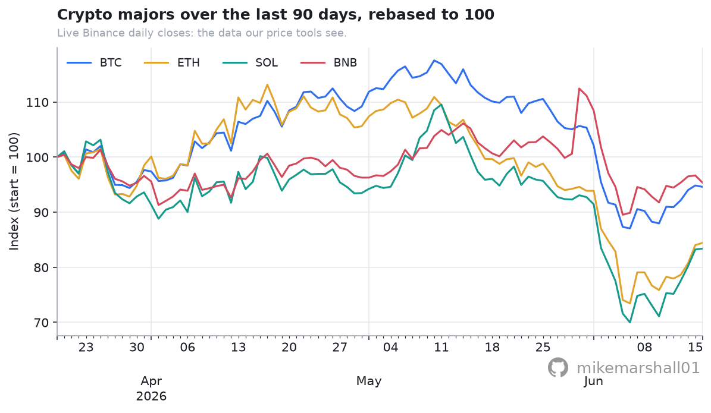
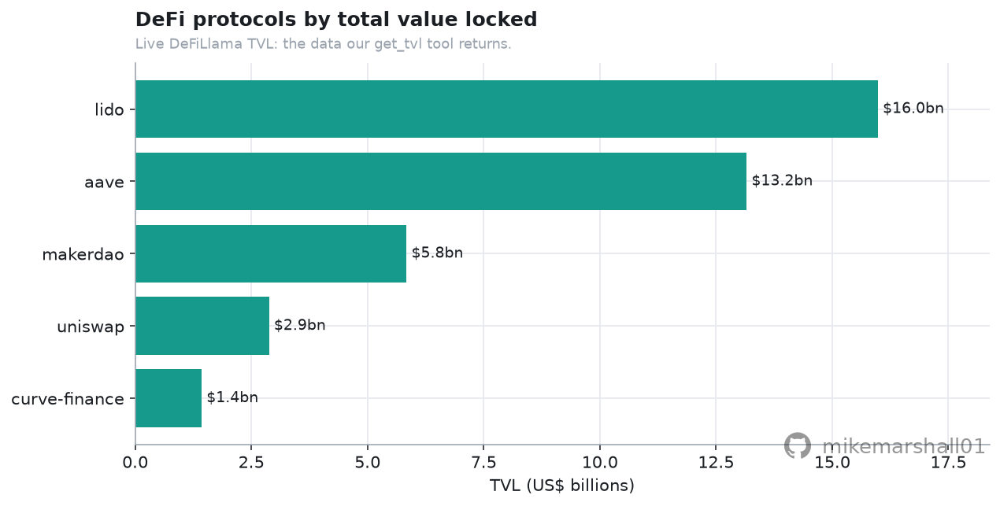

# An LLM Market-Data Agent (Tool Use) over Free Crypto Data

A hands-on, **free-data** walkthrough of **tool use** (function calling): build a small
agent that takes a plain-English question about crypto markets, decides which data to
fetch, calls typed **tools** over free public APIs, and answers from real numbers rather
than from the model's memory. Written to be read as much as run.

The data tools use free, **keyless** endpoints (Binance, DeFiLlama). The single Claude call
is **optional**: with an `ANTHROPIC_API_KEY` it runs live; without one the notebook prints
the exact request and falls back to a committed, clearly-labelled cached example, so it
**executes end to end with no key**. Part of a wider crypto-quant handbook; this is the
applied-AI repo.

## About

This notebook began as my own notes while I taught myself how tool use (function calling)
works, by building a small agent that answers plain-English questions about crypto markets
from free data. I have tidied and organised it and put it online freely, in the hope that it
is useful to others working through the same concepts. The emphasis is on explaining the
ideas clearly, on free and public data. This is educational and illustrative work rather
than production code or formal research, and any figures are there to illustrate the method
rather than to report results. It is freely available under the MIT licence. Feedback and
corrections are welcome. Provided as is, for educational use, with no warranty.

---

## What you will learn

| Concept | What it is | Where |
|---|---|---|
| **Tool use / function calling** | why a language model needs tools, and what a "function call" actually is | §1 |
| **Staleness, on synthetic data** | why "answer from memory" decays like sigma x sqrt(time since training cut-off) | §2 |
| **Typed tools with JSON Schema** | the `{name, description, input_schema}` contract, validated with `jsonschema` on a toy form and the real tools | §3 |
| **Summarising inside a tool** | the context budget measured: raw OHLCV rows vs the tool's compact summary | §4 |
| **The tool-use request** | an ordinary Messages API call plus a `tools` menu and `tool_choice`; reading every field | §5 |
| **The agent loop** | `stop_reason`, full-content appends, matched `tool_use_id`s, capped rounds | §6 |
| **Graceful degradation** | gating the keyed call behind `ANTHROPIC_API_KEY` with a clearly labelled cached fallback | §7 |
| **A mechanical grounding check** | reconciling every number in the final answer against the raw tool outputs | §8 |
| **Failure modes and disciplines** | staleness laundering, prompt injection via tool results, side effects, cost runaway | §9 |

## Example output

The notebook hands the agent one question:

> *"How has ETH performed over the last 30 days, what is it trading at now, and how does
> Aave's TVL compare to Lido's?"*

The model plans the work itself and requests all four tool calls in a single turn
(`get_klines_summary`, `get_price`, and `get_tvl` twice). The loop runs them against free,
keyless APIs and the model answers from the real numbers. In the committed cached example,
**Lido leads Aave on TVL by roughly 20%** (about $14.9bn vs $12.3bn), while ETH shows a
positive 30-day return at around 58% annualised volatility. With a key set, the same loop
returns today's live figures instead.

| | |
|---|---|
|  |  |
|  |  |

> The cached answer is **illustrative**: its market numbers are a snapshot and will not
> match today's data. The *data tools* always run live; only the *Claude reasoning* is
> cached when no key is set. The notebook is explicit about this throughout.

## Data

- **Binance public REST** (`/api/v3/ticker/24hr`, `/api/v3/klines`): free, **keyless**
  spot prices and daily candles for the majors.
- **DeFiLlama public REST** (`/tvl/{slug}`): free, **keyless** total-value-locked for DeFi
  protocols (Aave, Lido, Uniswap, ...).
- **Anthropic API** (optional): only the agent's *reasoning* step. Gated behind
  `ANTHROPIC_API_KEY`; the notebook runs without it using a committed cached transcript.

## Run it

```bash
git clone <this-repo> && cd llm-market-data-agent
python3 -m venv .venv && source .venv/bin/activate
pip install -r requirements.txt

# If `python -m venv` reports "ensurepip is not available" (some minimal Ubuntu/WSL setups),
# either install the venv package once:   sudo apt install -y python3-venv python3-pip
# or bootstrap pip into the venv:          curl -sS https://bootstrap.pypa.io/get-pip.py | .venv/bin/python

# No key needed: the data tools are keyless and the Claude call has a cached fallback.
# To run the agent LIVE against Claude, copy .env.example to .env and add your key:
#   ANTHROPIC_API_KEY=sk-ant-...    (then `set -a; source .env; set +a`)

# Option A: open the notebook
jupyter notebook notebooks/01_market_data_agent.ipynb

# Option B: re-run headless from the .py source (jupytext keeps .py and .ipynb in sync)
jupytext --to notebook notebooks/01_market_data_agent.py
jupyter nbconvert --to notebook --execute --inplace notebooks/01_market_data_agent.ipynb
```

### Cached by default, live if you want

Out of the box this runs with **no API key**. The agent's Claude calls read a committed, clearly labelled illustrative transcript (`data/cached_agent_run.json`) and the data tools are free and keyless, so the notebook executes end to end with no API key (the data tools still fetch live).

To run it live against the real model instead, get an **Anthropic API key** from [console.anthropic.com](https://console.anthropic.com). It is a pay-as-you-go API key, separate from any Claude.ai or Claude Code subscription, and a live run costs a few pence. Then:

```bash
cp .env.example .env          # .env is gitignored; never commit a real key
# add to .env:  ANTHROPIC_API_KEY=sk-ant-...
set -a; source .env; set +a
```

The cached file is hand-authored and illustrative, not a recording of a specific model run, so live output will differ. Anything you generate live is yours, under Anthropic's terms.

## Structure

```
llm-market-data-agent/
├── notebooks/
│   └── 01_market_data_agent.ipynb     # the walkthrough (executed, charts inline)
│   └── 01_market_data_agent.py        # same notebook as a readable .py (jupytext)
├── src/
│   ├── tools.py    # the typed tools (get_price, get_klines_summary, get_tvl) + JSON schemas
│   └── style.py    # shared house chart style (consistent look across the handbook)
├── assets/         # rendered charts (committed, so they show in this README)
├── data/
│   └── cached_agent_run.json          # committed illustrative cached Claude transcript
├── requirements.txt
└── .env.example
```

## Caveats

This is an **educational** example, not a production agent and not investment advice. The
notebook is explicit about its limits: the cached path is a frozen snapshot (set a key for
live answers); tools can fail and need retries and validation; a tool that can spend money
or write data needs human-in-the-loop approval; the model can still misread a number, so
verify anything that matters against the raw tool outputs the notebook prints; and free
endpoints are rate-limited and occasionally region-blocked.

## Licence

MIT.
